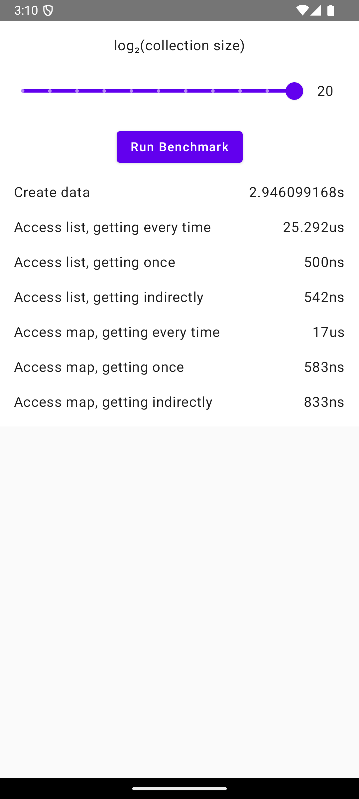
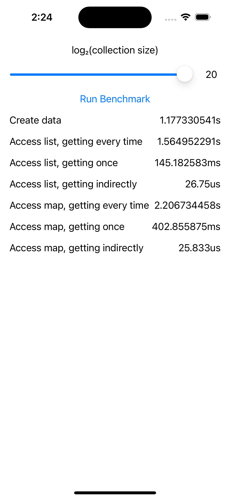

# Kotlin Multiplatform Has Serious Performance Issues Turning Kotlin Collections Into Swift Collections

If you have a Kotlin function (including a getter) that returns a `Map<K, V>` or `List<T>`, calling it from Swift will return a Swift `[K: V]` or `[T]`.  This is convenient, but I was surprised to discover just how much it costs at runtime.

| Android                                                                                      | iOS                                                                                  |
|----------------------------------------------------------------------------------------------|--------------------------------------------------------------------------------------|
|  |  |

Say we have a

```kotlin
data class Data(val list: List<String>, val map: Map<String, String>) {
    fun getFromList(index: Int) = list.getOrNull(index)
    fun getFromMap(key: String) = map[key]
}
```

which exposes the collections directly and also provides indirect getters for accessing elements of those collections. In this case, we need to get the total length of the strings at some fixed positions in the list or with some fixed keys in the map. The naive approach is to just use `data.list[i]` or `data.map[key]` as needed, but a very slightly optimized approach would be to get `data.list` or `data.map` only once. Intuitively, using the indirect getters should not be meaningfully faster than either approach.

On Android, it saves a handful of microseconds to call the getter only once or to go via the indirect getter, but even the naive approach is fast enough that it doesn't matter:

<table>
<thead>
<tr>
<th>Label</th><th>Android code</th><th>absolute time</th><th>relative speed</th>
</tr>
</thead>
<tbody>
<tr>
<td>Access list, getting every time</td><td>

```kotlin
var totalLength = 0
for (i in 1..5) {
    totalLength += data.list.getOrNull(i)?.length ?: 0
}
```

</td><td>25.29us</td><td>1x</td>
</tr>
<tr>
<td>Access list, getting once</td><td>

```kotlin
val list = data.list
var totalLength = 0
for (i in 1..5) {
    totalLength += list.getOrNull(i)?.length ?: 0
}
```

</td><td>500ns</td><td>51x</td>
</tr>
<tr>
<td>Access list, getting indirectly</td><td>

```kotlin
var totalLength = 0
for (i in 1..5) {
    totalLength += data.getFromList(i)?.length ?: 0
}
```

</td><td>542ns</td><td>47x</td>
</tr>
<tr>
<td>Access map, getting every time</td><td>

```kotlin
var totalLength = 0
for (key in listOf("lorem", "ipsum", "dolor", "sit", "amet")) {
    totalLength += data.map[key]?.length ?: 0
}
```

</td><td>17us</td><td>1x</td>
</tr>
<tr>
<td>Access map, getting once</td><td>

```kotlin
val map = data.map
var totalLength = 0
for (key in listOf("lorem", "ipsum", "dolor", "sit", "amet")) {
    totalLength += map[key]?.length ?: 0
}
```

</td><td>583ns</td><td>29x</td>
</tr>
<tr>
<td>Access map, getting indirectly</td><td>

```kotlin
var totalLength = 0
for (key in listOf("lorem", "ipsum", "dolor", "sit", "amet")) {
    totalLength += data.getFromMap(key)?.length ?: 0
}
```

</td><td>833ns</td><td>20x</td>
</tr>
</tbody>
</table>

On iOS, however, the getter is so slow that calling it five times takes over a second, and even calling it once is so slow it can't be done on the UI thread:

<table>
<thead>
<tr>
<th>Label</th><th>iOS code</th><th>absolute time</th><th>relative speed</th>
</tr>
</thead>
<tbody>
<tr>
<td>Access list, getting every time</td><td>

```swift
var totalLength = 0
for i in 1...5 {
    if data!.list.indices.contains(i) {
        totalLength += data!.list[i].count
    }
}
```

</td><td>1.56s</td><td>1x</td>
</tr>
<tr>
<td>Access list, getting once</td><td>

```swift
let list = data!.list
var totalLength = 0
for i in 1...5 {
    if list.indices.contains(i) {
        totalLength += list[i].count
    }
}
```

</td><td>145.18ms</td><td>11x</td>
</tr>
<tr>
<td>Access list, getting indirectly</td><td>

```swift
var totalLength = 0
for i in 1...5 {
    totalLength += data!.getFromList(index: Int32(i))?.count ?? 0
}
```

</td><td>26.75us</td><td>58503x</td>
</tr>
<tr>
<td>Access map, getting every time</td><td>

```swift
var totalLength = 0
for key in ["lorem", "ipsum", "dolor", "sit", "amet"] {
    totalLength += data!.map[key]?.count ?? 0
}
```

</td><td>2.21s</td><td>1x</td>
</tr>
<tr>
<td>Access map, getting once</td><td>

```swift
let map = data!.map
var totalLength = 0
for key in ["lorem", "ipsum", "dolor", "sit", "amet"] {
    totalLength += map[key]?.count ?? 0
}
```

</td><td>402.86ms</td><td>5x</td>
</tr>
<tr>
<td>Access map, getting indirectly</td><td>

```swift
var totalLength = 0
for key in ["lorem", "ipsum", "dolor", "sit", "amet"] {
    totalLength += data!.getFromMap(key: key)?.count ?? 0
}
```

</td><td>25.83us</td><td>85423x</td>
</tr>
</tbody>
</table>

It certainly appears as though turning the Kotlin `List` and `Map` into a Swift `Array` and `Dictionary` takes linear time and so needs to be avoided entirely for collections which may grow to be rather large. I find this counterintuitive - constant-time list indexing and logarithmic-time map lookups should not invisibly become linear-time because of a property read. This is, as far as I’m concerned, a bug in Kotlin/Native; if it’s an unavoidable consequence of Kotlin/Native targeting first Objective-C and only incidentally Swift, it should at the very least be documented and easy to avoid. I’m rarely even taking advantage of the fact that Kotlin collections become Swift collections; if there were a compiler setting to leave the collections as-is and require ugly `KotlinBoolean`-esque glue all over the place, I’d absolutely just turn that setting on and deal with the consequences.

These values were checked on release builds running on different emulators on the same host, so a single order of magnitude difference might be an artifact of differences in emulation overhead, but this is not that. These values come from a collection size of $2^{20}$ (although `data.map` is less than half that size due to how I generate it), but the issue is still visible on iOS at merely reasonably large collection sizes (I discovered it in practice in a map with 50,000 entries).
